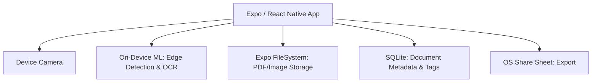

# PDF Scanner Architecture

**Document:** ARCHITECTURE.md  
**Product:** PDF Scanner & Document Tool  
**Publisher:** Heldig Lab  
**Price:** Paid Upfront (One-Time Purchase). No Subscriptions.  
**Source of Truth:** [SPEC.md](./SPEC.md)  
**Related Documents:** [REQUIREMENTS.md](./REQUIREMENTS.md), [NON-FUNCTIONAL-REQUIREMENTS.md](./NON-FUNCTIONAL-REQUIREMENTS.md)

## Purpose

This document defines the architecture for the "PDF Scanner & Document Tool". It covers:

- Expo / React Native app structure
- On-Device Machine Learning (Edge Detection & OCR)
- Local FileSystem & SQLite data model
- Export and Sharing mechanisms
- **The Zero-Backend, Zero-Subscription Constraint**

## Architectural Principles & Competitive Edge

- **Strictly No Backend:** The app operates entirely offline. There are no servers, no cloud sync, and no user accounts. This enforces our absolute privacy guarantee.
- **On-Device Processing:** All document edge detection, cropping, perspective correction, image enhancement, and Optical Character Recognition (OCR) are performed using on-device ML models (e.g., Apple Vision Framework / MLKit).
- **One Price Forever:** The business model dictates a single upfront App Store / Play Store purchase. There is no RevenueCat integration, no trials, and no recurring billing logic in the codebase.
- **Data Portability:** Documents are stored in the local file system and can be exported as standard PDFs or JPEGs to the OS share sheet.

## System Context



## High-Level Component Model

### Client Layer

The client is an Expo-managed React Native app using:

- **React Navigation:** Stack navigation (Home Library, Camera Viewfinder, Edit/Crop View, Document Detail).
- **VisionCamera / Expo Camera:** High-performance raw frame processing for real-time edge detection.
- **On-Device ML:** Native modules bridging iOS Vision and Android ML Kit for OCR and perspective transform.
- **Expo FileSystem:** Secure, sandboxed local storage for original images and generated PDFs.
- **SQLite (expo-sqlite):** Fast indexing of document metadata (names, creation dates, extracted text for searching).

### The "No Backend" Reality

There is absolutely no backend infrastructure.
- No analytics tracking (mixpanel, amplitude, etc.).
- No crashlytics that leak PII.
- No cloud storage dependencies.

## Data Model (SQLite & FileSystem)

### FileSystem
- `/documents/{uuid}/original.jpg`
- `/documents/{uuid}/enhanced.jpg`
- `/documents/{uuid}/compiled.pdf`

### SQLite (`documents` table)
- `id`: UUID (Primary Key)
- `title`: String
- `created_at`: Timestamp
- `page_count`: Integer
- `extracted_text`: Text (Used for full-text offline search)
- `tags`: String (Comma separated)

### SQLite Schema

```sql
-- Each scanned document (may contain multiple pages)
CREATE TABLE documents (
    id              TEXT PRIMARY KEY,                        -- UUID
    title           TEXT NOT NULL,                           -- user-editable, defaults to "Scan YYYY-MM-DD HH:MM"
    page_count      INTEGER NOT NULL DEFAULT 0,
    total_size_bytes INTEGER NOT NULL DEFAULT 0,             -- sum of all page image sizes
    created_at      TEXT NOT NULL DEFAULT (datetime('now')),
    updated_at      TEXT NOT NULL DEFAULT (datetime('now'))
);

-- Individual pages within a document
CREATE TABLE pages (
    id              TEXT PRIMARY KEY,                        -- UUID
    document_id     TEXT NOT NULL REFERENCES documents(id) ON DELETE CASCADE,
    page_number     INTEGER NOT NULL,                        -- 1-based ordering within the document
    image_path      TEXT NOT NULL,                           -- local FS path to enhanced/flattened image
    thumbnail_path  TEXT,                                    -- local FS path to thumbnail for grid view
    extracted_text  TEXT,                                    -- OCR output for full-text search
    created_at      TEXT NOT NULL DEFAULT (datetime('now'))
);

-- Tag definitions for organizing documents
CREATE TABLE tags (
    id              TEXT PRIMARY KEY,                        -- UUID
    name            TEXT NOT NULL UNIQUE                     -- e.g. "Receipts", "Contracts"
);

-- Many-to-many join: documents <-> tags
CREATE TABLE document_tags (
    document_id     TEXT NOT NULL REFERENCES documents(id) ON DELETE CASCADE,
    tag_id          TEXT NOT NULL REFERENCES tags(id) ON DELETE CASCADE,
    PRIMARY KEY (document_id, tag_id)
);

-- Indexes
CREATE INDEX idx_pages_document           ON pages(document_id);
CREATE INDEX idx_documents_created        ON documents(created_at);        -- library sort-by-date
CREATE INDEX idx_document_tags_tag        ON document_tags(tag_id);        -- find docs by tag

-- Full-text search virtual table for OCR text + document titles
CREATE VIRTUAL TABLE pages_fts USING fts5(
    extracted_text,
    content='pages',
    content_rowid='rowid'
);
```

## Processing Pipeline

### 1. Capture & Edge Detection
- Camera feeds frames to a lightweight edge-detection model.
- AR overlay draws a blue polygon over the detected document in real-time.
- User captures; full-res image is saved to temporary storage.

### 2. Perspective Transform & Enhancement
- User confirms or adjusts the 4 corners.
- OpenCV/Native transform flattens the image.
- Image filters applied (B&W, Grayscale, Color Enhancement).

### 3. OCR & PDF Generation
- On-device OCR extracts text for searchability.
- Images are compiled into a PDF document and saved to the local FileSystem.